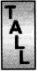

文本属性
===

>**缩进和水平对齐**

text-indent  应用于块级元素首行缩进

```p{text-indent: 3em;}```

---
text-align 块级元素水平对齐

left center right justify(左右对齐) inherit


>**垂直对齐**

line-height 文本行基线之间的距离 通常normal值是font-size 1.2倍，自定义的line-height会在内容区的上下侧均分

line-height继承于父元素时候,高度计算也是由父元素配置而不是子元素

<div  style="font-size: 10px; width: 100px">
<div style="line-height: 1em;border: 1px solid">
<p style="font-size: 18px">Lorum ipsum dora sit amet</p>
</div>
</div>

但是可以指定高度缩放因子```line-height: 1```

<div  style="font-size: 10px; width: 100px">
<div style="line-height: 1;border: 1px solid">
<p style="font-size: 18px">Lorum ipsum dora sit amet</p>
</div>
</div>

---

vertical-align

base-line(默认) 

<div style="line-height: 1;border: 1px solid;width:200px">
<p style="font-size: 18px">Lorum ipsum dora sit amet</p>
</div>

sub 变为下标

<div style="line-height: 1;border: 1px solid;width:200px">
<p style="font-size: 18px">Lorum ipsum dora<span style="vertical-align:sub"> sit</span> amet</p>
</div>

bottom 行底端对齐

<div style="line-height: 1;border: 1px solid;width:200px">
<p style="font-size: 18px">Lorum ipsum 
dora sit amet</p>
</div>

text-bottom 文本底端(好像一样)

<div style="line-height: 1;border: 1px solid;width:200px">
<p style="font-size: 18px">Lorum ipsum
dortopa sit amet</p>
</div>

top 文本行顶端

<div style="line-height: 1;border: 1px solid;width:200px">
<p style="font-size: 18px">Lorum ipsum
dortopa sit amet</p>
</div>

middle 文本居中 图像的垂直中点在基线上方0.25em

<div style="line-height: 1;border: 1px solid;width:200px">
<p style="font-size: 18px">Lorum ipsum
dortopa sit amet</p>
</div>

>**字间隔和字母间隔**

word-spacing
letter-spaceing

>**文本转换**

text-transform

uppercase大写
lowercase小写
capitalize首字母大写

>**文本装饰**

text-decoration


underline overline line-through

```
<div style="line-height: 1;border: 1px solid;width:300px">
<p style="font-size: 18px;text-decoration:underline">Lorum ipsum dora sit amet</p>
<p style="font-size: 18px;text-decoration:overline">Lorum ipsum dora sit amet</p>
<p style="font-size: 18px;text-decoration:line-through">Lorum ipsum dora sit amet</p>
<p style="font-size: 18px;text-decoration:overline">Lorum <span style="font-size: 25px"> ipsum</span> dora sit amet</p>
<p style="font-size: 18px;text-decoration:overline">Lorum <span style="font-size: 25px; text-decoration: none;"> ipsum</span> dora sit amet</p>
</div>
```

<div style="line-height: 1;border: 1px solid;width:300px">
<p style="font-size: 18px;text-decoration:underline">Lorum ipsum dora sit amet</p>
<p style="font-size: 18px;text-decoration:overline">Lorum ipsum dora sit amet</p>
<p style="font-size: 18px;text-decoration:line-through">Lorum ipsum dora sit amet</p>
<p style="font-size: 18px;text-decoration:overline">Lorum <span style="font-size: 25px"> ipsum</span> dora sit amet</p>
<p style="font-size: 18px;text-decoration:overline">Lorum <span style="font-size: 25px; text-decoration: none;"> ipsum</span> dora sit amet</p>
</div>

>**空白符**

white-space 

normal: 去除多余空白符，换行变空格

nowrap：防止换行
<div style="line-height: 1;border: 1px solid;width:300px">
<p style="font-size: 18px;white-space:nowrap">Lorem ipsum dolor sit amet, consectetur adipiscing elit.</p>
</div>

pre：额外空格和回车保留
pre-wrap pre-line inherit